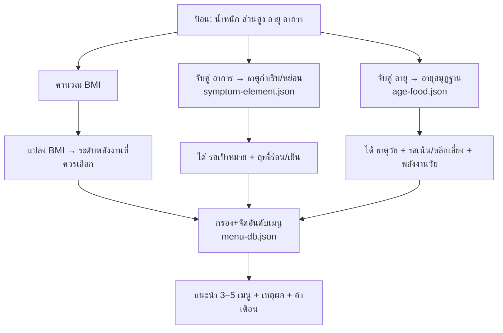

# เครื่องแนะนำเมนูตามร่างกาย (Food Recommender) — สเปกฐานข้อมูล

> ⚠️ **คำเตือนสำคัญ (ต้องแสดงในทุกหน้าเผยแพร่)**
> คำแนะนำนี้อ้างอิง **ภูมิปัญญาแพทย์แผนไทย เพื่อการส่งเสริมสุขภาพเชิงป้องกัน** — **ไม่ใช่การวินิจฉัยหรือรักษาโรค** และไม่ทดแทนคำแนะนำของแพทย์/นักกำหนดอาหาร หากมีอาการรุนแรง เรื้อรัง มีโรคประจำตัว ตั้งครรภ์ หรือแพ้อาหาร ให้ปรึกษาผู้เชี่ยวชาญ

> 🌐 **source_type: external** · 📎 **Curriculum anchor**: TA301 (ม.ธรรมศาสตร์) — ดู [[reference-sources]]

## เป้าหมาย

ทำให้ประชาชนทั่วไป **ป้อนข้อมูลร่างกาย → ได้เมนูอาหารแนะนำ** ตามหลักแพทย์แผนไทย เชื่อม 3 ชั้นความรู้ที่วางไว้:
- **น้ำหนัก/ส่วนสูง → BMI → พลังงาน** (แกนแคลอรี↔ธาตุไฟ [[food-analysis-ttm]])
- **อายุ → อายุสมุฏฐาน → ธาตุ/รสตามวัย** (แพทย์แผนไทย — ดูตารางด้านล่าง)
- **อาการ → ธาตุกำเริบ/หย่อน → รส+ฤทธิ์** ([[dhatu-4-plants]] · [[herbal-taste-9]])
- **รส+ฤทธิ์+พลังงาน → เมนู** (ฐานข้อมูล [[food-dhatu-plants]])

## สถาปัตยกรรมข้อมูล (Data model)

ข้อมูลเก็บเป็น **JSON เครื่องอ่านได้** ใน `data/` เพื่อให้ต่อยอดเป็นเว็บ/แอปได้โดยไม่ผูกกับ Obsidian:

| ไฟล์ | หน้าที่ | ฟิลด์หลัก |
|------|---------|-----------|
| `data/menu-db.json` | ฐานข้อมูลเมนู | `name, tastes[], thermal, energy, suitFor[], cautionFor[], symptoms[], mainPlants[], note, patientFor[]` · **Tier 2:** `analysisTier, ingredients{core,optional}, layerS[], whenCooked{suitAudience,avoidFor,summary}` |
| `data/symptom-element.json` | กฎแปลงอาการ→ธาตุ→รส | `symptoms[], element, state, recommendTaste[], recommendThermal, why` |
| `data/age-food.json` | กฎอายุสมุฏฐาน→ธาตุ/รสตามวัย | `bands[]: minAge, maxAge, samutthana, dominantElement, recommendTaste[], avoidTastes[], preferEnergy[], boostPatientContexts[]` |

- `thermal`: ร้อน / อุ่น / กลาง / เย็น
- `energy`: ต่ำ / กลาง / สูง (เชิงคุณภาพ — ปรับเป็น kcal จริงภายหลังได้)
- `suitFor` / `cautionFor`: ธาตุ ดิน / น้ำ / ลม / ไฟ

### วิเคราะห์เมนู 3 ระดับ (Tier)

| Tier | เก็บที่ไหน | เนื้อหา |
|------|-----------|---------|
| **1** | `menu-db.json` (เดิม) | `tastes, thermal, energy, suitFor, symptoms, note` — ใช้จัดอันดับ |
| **2** | `menu-db.json` + `data/menu-analysis-tier2-*.json` | `ingredients`, `layerS`, `whenCooked` — แสดงใน UI ปุ่ม「ดูวิเคราะห์」 |
| **3** | `wiki/menus/{id}.md` | บทวิเคราะห์เต็ม S/U/T + แหล่งอ้างอิง — สอน/อ่านลึก |

รอบ 1 (แกง/ต้ม): **28 เมนู** มี `analysisTier: 2` รวม **แกงหน่อไม้** (ใหม่) · Tier 3 ตัวอย่าง: [[menus/gaeng-nor-mai]], [[menus/tom-yum-goong-nam-sai]], [[menus/gaeng-liang]]

```bash
python scripts/merge-menu-analysis.py   # รวม tier2 เข้า menu-db.json
```

## กระบวนการตัดสินใจ (Decision flow)



## อายุกับการเลือกอาหาร (อายุสมุฏฐาน)

ตำราแพทย์แผนไทยแบ่ง **อายุสมุฏฐาน** เป็น 4 วัย — แต่ละวัยมีธาตุเด่นและรสที่เหมาะต่างกัน (ไม่ใช่แค่ปริมาณแคลอรี) ฐาน `age-food.json` ใช้ช่วงอายุปฏิบัติที่สอดคล้องกับแหล่งสถาบัน:

| วัย | อายุ (ปี) | สมุฏฐาน | ธาตุเด่น | รสที่เน้น | หลีกเลี่ยง | โภชนาการสมัยใหม่ (สรุป) |
|-----|-----------|---------|----------|-----------|-----------|-------------------------|
| **ปฐมวัย** | 0–15 | อาโป/เสมหะ | น้ำ | หวาน เปรี้ยว ขม จืด | เผ็ดร้อน | ครบ 5 หมู่ โปรตีน-แคลเซียมสำหรับเติบโต · นุ่ม ไม่เผ็ดจัด |
| **มัชฌิมวัย** | 16–31 | อาโป/โลหิต-ดี | น้ำ | เปรี้ยว ฝาด ขม เค็ม | — | พลังงานตามกิจกรรม · ลดหวาน-เค็มจัดถ้าน้ำหนักเกิน |
| **ปัจฉิมวัย (กลาง)** | 32–63 | วาโย/ลม | ลม | ขม เผ็ดร้อน เค็ม ฝาด | — | คุมน้ำหนัก-NCDs · ผักผลไม้เพียงพอ |
| **ปัจฉิมวัย (ผู้สูงอายุ)** | 64+ | วาโย/ลม + เสื่อมถอย | ลม | จืด ขม หวาน | เผ็ดร้อน | โปรตีนเพียงพอ ป้องกันมลัดถอยกล้ามเนื้อ · นุ่ม กลืนง่าย |

### ตรรกะในเครื่องแนะนำ (`recommender.js`)

1. **จับวัย**: `getAgeBand(age, bands)` จาก `age-food.json`
2. **รวมเป้าหมาย**: `mergeTargets()` รวมรส/ธาตุ/ฤทธิ์จาก **อาการ + อายุ** (อาการมีน้ำหนักเท่ากันในการรวมรส)
3. **พลังงานวัย**: ผู้สูงอายุ/เด็ก → จำกัด `preferEnergy` เป็น ต่ำ–กลาง (ทับ BMI ยกเว้นโหมดผู้ป่วย)
4. **หลีกเลี่ยงรส**: เมนูที่มี `avoidTastes` ของวัย (เช่น เผ็ดร้อน ในวัยเด็ก/ผู้สูงอายุ) → ลดคะแนน
5. **บูสต์ผู้สูงอายุ**: วัย 64+ ให้คะแนนเพิ่มเมนูที่มี `patientFor` ตรง `ผู้สูงอายุ` / `ฟื้นตัว` / `กลืนลำบาก`

> หมายเหตุ: อายุสมุฏฐาน ≠ ธาตุเจ้าเรือนจากวันเกิด — ใช้ร่วมกับ BMI และอาการปัจจุบัน ไม่ใช่การวินิจฉัยโรค

### ตรรกะการจับคู่ (matching)
1. **อาการ → ธาตุ**: สแกน `symptom-element.json` เอา rule ที่อาการตรง → รวม `recommendTaste` + `recommendThermal`
2. **อายุ → วัย**: สแกน `age-food.json` → รวม `dominantElement`, `recommendTaste`, `avoidTastes`, `preferEnergy`
3. **BMI → พลังงาน** (เกณฑ์เอเชีย-แปซิฟิก):

| BMI | ระดับ | ทิศพลังงานเมนู |
|-----|-------|-----------------|
| < 18.5 | ผอม | อนุญาต `energy` กลาง–สูง · เน้นบำรุง (หวาน/มัน) |
| 18.5–22.9 | ปกติ | `energy` ต่ำ–กลาง สมดุล |
| 23–24.9 | น้ำหนักเกิน | เน้น `energy` ต่ำ ผักเยอะ |
| ≥ 25 | อ้วน | **เฉพาะ** `energy` ต่ำ · เลี่ยงมัน/ทอด/กะทิ |

3. **กรองเมนู**: เลือกเมนูที่ `suitFor` มีธาตุเป้าหมาย **และ** `thermal` เข้าทาง **และ** `energy` เข้าเกณฑ์ BMI+วัย
4. **ตัดออก**: ถ้าธาตุผู้ใช้อยู่ใน `cautionFor` → ลดอันดับ/ตัด; รสใน `avoidTastes` ของวัย → ลดคะแนน
5. **จัดอันดับ**: นับจำนวนอาการที่ตรงใน `menu.symptoms` + รสตามวัย + `patientFor` (ผู้สูงอายุ)

## ตัวอย่างการทำงาน (Worked example)

**อินพุต**: น้ำหนัก 80 กก. · สูง 165 ซม. · อาการ = "ท้องอืด, เบื่ออาหาร"

1. BMI = 80 / 1.65² = **29.4 → อ้วน** → เมนู `energy` **ต่ำ** เท่านั้น เลี่ยงมัน
2. อาการ "ท้องอืด" → ธาตุ **ลม กำเริบ** → รส **เผ็ดร้อน** ฤทธิ์ **ร้อน**; "เบื่ออาหาร" → รส **ขม/เผ็ดร้อน**
3. กรอง menu-db: `suitFor` มี "ลม" + `thermal` ร้อน + `energy` ต่ำ
   - ✅ **ต้มยำกุ้งน้ำใส** (ลม, ร้อน, ต่ำ, ตรง "ท้องอืด+เบื่ออาหาร")
   - ✅ **ส้มตำ** (ลม, ร้อน, ต่ำ, "เบื่ออาหาร+ท้องอืด")
   - ❌ **ต้มข่าไก่กะทิ** — ถูกตัด (energy สูง, ขัดเกณฑ์อ้วน)
4. **ผลลัพธ์**: แนะนำ ต้มยำกุ้งน้ำใส · ส้มตำ · แกงเลียง — พร้อมเหตุผล "ขับลม เจริญอาหาร แคลอรีต่ำเหมาะน้ำหนักเกิน" + คำเตือน

→ สังเกต: จุดนี้คือที่ **แกนแคลอรี (BMI) กับแกนธาตุ (อาการ) ทำงานร่วมกัน** — เลือก "ร้อนเพื่อขับลม" แต่ "ต่ำเพื่อคุมน้ำหนัก" พร้อมกัน

### ตัวอย่างตามอายุ

**อินพุต**: อายุ **72** ปี · น้ำหนัก 58 กก. · สูง 160 ซม. · ไม่มีอาการ

1. วัย **ปัจฉิมวัย (ผู้สูงอายุ)** → ธาตุ **ลม** · รส **จืด ขม หวาน** · หลีกเลี่ยง **เผ็ดร้อน** · พลังงาน ต่ำ–กลาง
2. BMI = 22.7 → ปกติ (สอดคล้องพลังงานวัย)
3. เมนูที่ได้คะแนนสูง: **ข้าวต้มไก่**, **โจ๊กปลาใส่ขิง**, **แกงจืดเต้าหู้** — อ่อน จืด อุ่น มี `patientFor: ผู้สูงอายุ`
4. เมนูที่ลดคะแนน: แกงเผ็ดจัด/ต้มยำเผ็ดร้อน (รสเผ็ดร้อนวัยนี้ควรหลีกเลี่ยง)

**อินพุต**: อายุ **10** ปี · อาการ "ท้องอืด"

1. วัย **ปฐมวัย** → ธาตุ **น้ำ** · หลีกเลี่ยง **เผ็ดร้อน**
2. อาการท้องอืด → ธาตุ **ลม** กำเริบ → รส **เผ็ดร้อน** (ขัดกับวัยเด็ก — เครื่องจะลดคะแนนเมนูเผ็ดจัด)
3. เน้นเมนู **กลาง/อุ่น** ย่อยง่าย: แกงจืด, ผัดผัก, ซุป — ไม่เผ็ดจัด

## ข้อจำกัด / ความปลอดภัย

- เป็นคำแนะนำ **เชิงส่งเสริมสุขภาพ** ไม่วินิจฉัย/รักษาโรค (ตรงกรอบวิชา TA301 ที่เน้นป้องกัน)
- ธาตุเจ้าเรือนจริงมาจากวันเกิด — เครื่องนี้ใช้ **อายุสมุฏฐาน + อาการปัจจุบัน** เป็นค่าประมาณ
- `energy` ยังเป็นเชิงคุณภาพ — เฟสถัดไปเติมค่า kcal ต่อหน่วยบริโภคจากแหล่งอ้างอิง
- ต้องมีตัวกรอง **แพ้อาหาร / โรคประจำตัว** ก่อนใช้งานจริง (เช่น เบาหวาน → คุมหวาน, ความดัน → คุมเค็ม)

## Roadmap (เฟสถัดไป)

1. ✅ ฐานข้อมูล JSON (menu-db + symptom-element + age-food) + สเปกกลไก (node นี้)
2. ✅ **เว็บ prototype** — `index.html` + `recommender.js` (ทั่วไป / ผู้ป่วย / อายุ)
3. ✅ ขยายฐานเมนู (124 เมนู) + แท็กผู้ป่วย + **วิเคราะห์ Tier 2 รอบ 1 (แกง/ต้ม 28 เมนู)**
4. ⏭️ วิเคราะห์ Tier 2 รอบ 2–5 (ยำ / อีสาน / นึ่งย่าง / ของว่าง)
5. ⏭️ เติมค่า kcal + รูปภาพ
6. ⏭️ ตัวกรองโรคประจำตัว/แพ้อาหาร + ธาตุเจ้าเรือนจากวันเกิด

## Prerequisites

- [[food-as-balance]] — แกนความรู้ "อาหารคือสมดุล" (ทำไมต้องบูรณาการสากล+ไทย)
- [[food-dhatu-plants]] · [[food-analysis-ttm]] · [[dhatu-4-plants]] · [[herbal-taste-9]]

## Leads to

- เว็บ prototype: `index.html` + `recommender.js` (รากโปรเจกต์)

## ที่มา (External sources) — เข้าถึง 2026-07-03

- [รายวิชา TA301 หลักสูตรแพทย์แผนไทยประยุกต์ — TU Moodle](https://moodle.tu.ac.th/course/index.php?categoryid=1253)
- [อาหารตามธาตุเจ้าเรือน — ศูนย์การแพทย์กาญจนาภิเษก ม.มหิดล](https://www.gj.mahidol.ac.th/main/tard/)
- [อาหารตามอายุสมุฏฐาน — คณะแพทยศาสตร์ ม.เชียงใหม่](https://www.med.cmu.ac.th/web/suandok/article-suandok/11268/)
- [รสยาแก้ตามวัย — samunpri.com](https://www.samunpri.com/pharmacy/%E0%B8%A3%E0%B8%AA%E0%B8%A2%E0%B8%B2%E0%B9%81%E0%B8%81%E0%B9%89%E0%B8%95%E0%B8%B2%E0%B8%A1%E0%B8%A7%E0%B8%B1%E0%B8%A2/)
- [อายุสมุฏฐาน — สารานุกรมไทยสำหรับเยาวชน](https://saranukromthai.or.th/oldchild/2712)
- เกณฑ์ BMI เอเชีย-แปซิฟิก (WHO/WPRO 2000)
