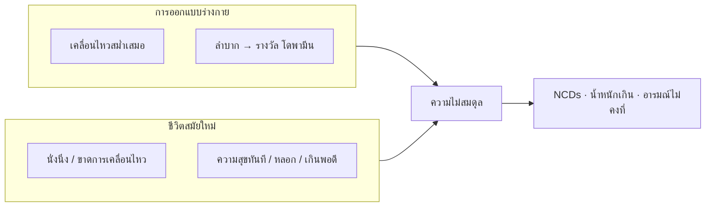
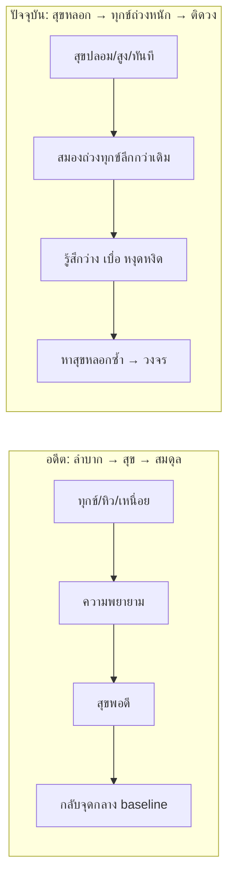
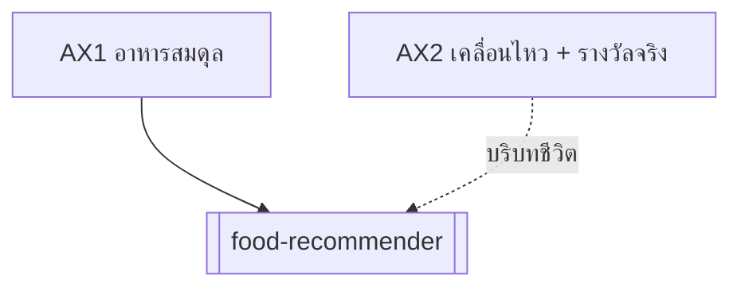

# มนุษย์ใช้ชีวิตผิดธรรมชาติ: การเคลื่อนไหวและความสุข

> 💡 **แกนความรู้ (Foundational axis AX2)** — คู่กับ [[food-as-balance]] (AX1)
> AX1 ว่า *อาหาร = เครื่องมือสมดุล* · AX2 ว่า *ชีวิตสมัยใหม่ขัดกับการออกแบบร่างกาย* ในอีกสองแกน

> 🌐 **source_type: external** — อ้างอิง WHO/NIH + ภาษาแผนไทย (ธาตุลม/ไฟ) · [[reference-sources]]

> ⚠️ เนื้อหานี้เพื่อ **ส่งเสริมสุขภาพและความเข้าใจตนเอง** — ไม่ใช่การวินิจฉัยโรคจิตหรือพฤติกรรมเสพติด หากมีปัญหาสุขภาพจิตหรือการเสพติด ให้ปรึกษาผู้เชี่ยวชาญ

## แก่นความคิด

มนุษย์วิวัฒนาการมา **~2 ล้านปี** ในสภาพแวดล้อมที่:
- ต้อง**เคลื่อนไหว**เกือบทุกวัน (หาเก็บ ล่า ย้ายถิ่น ทำงานกาย)
- ต้อง**ลำบากก่อนได้รางวัล** (หิวก่อนกิน · เหนื่อยก่อนพัก · รอคอยก่อนสำเร็จ)

ชีวิตเมืองยุคใหม่ (~100–200 ปี) กลับให้:
- **นั่งนิ่ง** เป็นค่าเริ่มต้น
- **ความสุขทันที** ราคาถูก (หวาน มัน เค็ม · จอ · เกม · ของมึนเมา)

→ เรียกได้ว่า **"ใช้ชีวิตผิดธรรมชาติ"** — ไม่ใช่ moral judgment แต่คือ **mismatch ระหว่าง biology กับ environment**

## แกน 1 — ร่างกายออกแบบให้เคลื่อนไหว แต่ไม่ชอบเคลื่อนไหว

### สิ่งที่ธรรมชาติออกแบบ

| มิติ | สรุป |
|-----|------|
| **สรีรวิทยา** | กล้ามเนื้อ กระดูก หัวใจ หลอดเลือด การเผาผลาญ — พัฒนามาคู่กับ**การเคลื่อนไหวสม่ำเสมอ** |
| **แผนไทย** | **ธาตุลม (วาโย)** = การเคลื่อนไหว หมุนเวียน นำส่ง — ลมต้อง**ไหล** ([[dhatu-4-plants]]) |
| **อายุรเวท** | **Vata** = ลม/การเคลื่อนไหว — ขาดการเคลื่อนไหว → Vata คงที่ผิดปกติหรือลมอุดตัน |
| **สากล** | WHO ระบุการขาดกิจกรรมทางกายเป็น**ปัจจัยเสี่ยงหลักของ NCDs** คู่กับอาหารไม่ดี |

### สิ่งที่เกิดจริง

- งานนั่งหน้าจอ · รถ · ลิฟต์ · ส่งของถึงบ้าน
- สมอง**หลีกเลี่ยงการใช้พลังงาน** (ประหยัดพลังงาน = survival trait ในอดีต)
- ผล: น้ำหนักเกิน · เบาหวาน · หัวใจ-หลอดเลือด · ท้องอืด (ลมไม่หมุน) · อ่อนเพลีย paradox (นั่งมากแต่เหนื่อย)

### สะพานกับ AX1 และโปรเจกต์

| ชีวิตผิดธรรมชาติ | แกน AX1 (อาหาร) | ใน Botany-Xambrain |
|----------------|----------------|---------------------|
| กินมาก + ไม่ขยับ | แคลอรีเกิน ธาตุไฟสะสม | [[food-recommender]] กรอง `energy: ต่ำ` เมื่อ BMI≥25 |
| ลมอุดตัน ท้องอืด | รสเผ็ดร้อนขับลม | เมนู `suitFor: ลม` + Tier 2 วิเคราะห์ |
| ขาดการเคลื่อนไหว | ไม่ใช่แกนอาหารเพียงอย่างเดียว | AX2 เตือน: **อาหารดีไม่พอ ถ้าไม่ขยับ** |

**หลักปฏิบัติ (สากล):** WHO แนะนำผู้ใหญ่ **150–300 นาที/สัปดาห์** กิจกรรมปานกลาง หรือเทียบเท่า + ลดพฤติกรรมนั่งนิ่ง

## แกน 2 — ความสุข: ลำบากก่อนโดพามีน vs ความสุขหลอก/เกิน

### หลักสมดุลสุข–ทุกข์ (Pleasure–Pain Balance) ⭐

สมองมีกลไก **รักษาสมดุล** ระหว่างความสุข (pleasure) กับความทุกข์/ไม่สบาย (pain) — เปรียบได้กับ**ตาชั่ง**: กดฝั่งหนึ่ง อีกฝั่งจะยกขึ้นเอง

> สรุปจากการฟังและสังเคราะห์ (สอดคล้อง Anna Lembke, *Dopamine Nation*): **ความสุขอยู่ไม่นาน** เพราะหลังสุข สมองจะ**ถ่วงน้ำหนักไปฝั่งทุกข์** เพื่อกลับสมดุล — ไม่ใช่ลงโทษ แต่เป็น **homeostasis** ของระบบรางวัล

| ลำดับ | ชีวิตตามธรรมชาติ (อดีต) | ชีวิตสมัยใหม่ (สุขหลอก) |
|-------|-------------------------|-------------------------|
| 1 | **ทุกข์/ขาด** ก่อน (หิว เหนื่อย เบื่อ) | **สุขทันที** ไม่ต้องลำบาก |
| 2 | **ลำบาก** แล้วได้รางวัล | สุข**สูงผิดปกติ** (หวานจัด scroll ฯลฯ) |
| 3 | สุขพอประมาณ | สุขสั้น — **อยู่ไม่นาน** |
| 4 | สมองถ่วงทุกข์**เล็กน้อย** → กลับ **baseline กลาง** | สมองถ่วงทุกข์**หนัก** → ตก**ต่ำกว่า**จุดเดิม (deficit state) |
| 5 | พร้อมลำบาก–สุขรอบใหม่ | **ติดจมทุกข์หลังสุข** · ต้องหาสิ่งกระตุ้นแรงขึ้นเรื่อยๆ |

**ความต่างสำคัญ:** ในอดีต วงจรคือ *ทุกข์ → ลำบาก → สุข → กลับกลาง* · ปัจจุบัน วงจรกลายเป็น *สุขหลอก → ทุกข์ถ่วงหนัก → หาสุขหลอกอีก* — **ไม่เคยพักที่จุดสมดุล**

> ⚠️ คำว่า "ทุกข์" ที่นี่ = ความไม่สบายทางอารมณ์/ร่างกายหลัง overstimulation (anhedonia, craving, หงุดหงิด, ว่างเปล่า) — ไม่ใช่ทุกข์ชีวิตในเชิงพุทธศาสนาโดยตรง แต่**ภาษาใกล้กัน**ในแง่ "หลังสุขแล้วไม่สบาย"

### สิ่งที่ธรรมชาติออกแบบ (ระบบรางวัล)

| ขั้น | กลไก | ตัวอย่างในธรรมชาติ |
|-----|------|-------------------|
| 1 | **ความต้องการ / ความไม่สบาย** | หิว · เหนื่อย · หนาว · เบื่อ |
| 2 | **ความพยายาม** | หาเก็บ · ล่า · เดินทาง · เรียนรู้ทักษะ |
| 3 | **รางวัล (โดพามีน)** | กินได้ · พักได้ · สำเร็จภารกิจ · ได้รับการยอมรับ |

→ ความสุขที่แท้ **ตามหลังความลำบาก** — ไม่ใช่ฟรี

### สิ่งที่เกิดจริง (ความสุขหลอก / เกินพอดี)

| ประเภท | ตัวอย่าง | ปัญหา |
|--------|---------|-------|
| **หลอก (supernormal stimulus)** | น้ำตาล/ไขมัน/เกลือเข้มข้น · อาหารแปรรูป · สื่อไม่สิ้นสุด | ได้โดพามีน**โดยไม่ต้องลำบาก** |
| **เกิน (hyper-pleasure)** | กินหวานต่อเนื่อง · เลื่อนจอไม่หยุด · ของมึนเมา | ระบบรางวัล**ชินต้องการมากขึ้น** (tolerance) |
| **ไม่สมดุล** | สุขชั่วคราวสูง → ฐานความสุขต่ำลง | อารมณ์แปรปรวน · เบื่อ · กิน/ใช้ซ้ำเพื่อหาความรู้สึกเดิม |

### สะพานกับแผนไทย

| มิติไทย | ตีความเชิง AX2 |
|---------|----------------|
| **รสหวานมาก / มันมาก** | บำรุงแต่**เกินปกติแปลว่าโรค** (หลักอติในอายุรเวท/แผนไทย) → [[food-analysis-ttm]] |
| **ธาตุไฟ (เตโช)** | ความสุขเร็ว-ร้อน-จัด = ไฟพุ่งแล้วดับ → ร้อนใน หงุดหงิด |
| **ธาตุลม** | ความสุขหลอกสั้น → ว่างเปล่า → ลมกำเริบ (ท้องอืด นอนไม่หลับ) |
| **สมดุล** | คู่กับ AX1: อาหารไม่ใช่แค่พลังงาน แต่**ไม่ควรเป็นเครื่องมือความสุขหลอกหลัก** |

### สะพานกับอาหารในโปรเจกต์

- **ของหวานมัน/เครื่องดื่มหวาน** = dopamine shortcut ทางปาก → `energy: สูง` + `cautionFor: ไฟ, น้ำ` ใน [[food-recommender]]
- **ยำ/อาหารรสจัด** = กระตุ้นไฟย่อยดีเมื่อ**พอประมาณ** · จัดเกิน = ความสุขปากแล้วไม่สมดุล
- **เมนู `cookMethod: นึ่ง/ต้ม`** = ลด supernormal stimulus จากทอด/หวานจัด

## AX1 + AX2 = กรอบสุขภาพครบวง

| แกน | คำถาม | เครื่องมือในโปรเจกต์ |
|-----|--------|---------------------|
| **AX1** อาหาร = สมดุล | กินอะไร ให้ธาตุ-พลังงานสมดุล? | [[food-dhatu-plants]] · [[food-analysis-ttm]] · [[food-recommender]] |
| **AX2** ชีวิตผิดธรรมชาติ | ขยับพอไหม? ความสุขมาจากลำบากหรือหลอก? | node นี้ (แนวทางปฏิบัติด้านล่าง) |

## แนวทางปฏิบัติ (เชิงส่งเสริมสุขภาพ)

### แกนเคลื่อนไหว

1. **เคลื่อนไหวทุกวัน** — เดิน ยืด ขึ้นบันได งานบ้าน (ไม่ต้องเป็นนักกีฬา)
2. **ลดนั่งต่อเนื่อง** — ลุกทุก 30–60 นาที
3. **เชื่อมกับอาหาร** — หลังกิจกรรม → มื้ออาหารจริงรสชาติธรรมชาติ (ไม่ใช่ของว่างหวานทันที)

### แกนความสุข / โดพามีน

1. **ลำบากก่อนรางวัล** — ทำภารกิจ/ออกกำลังกายก่อน พัก/กิน/บันเทิงทีหลัง
2. **ลด supernormal stimulus** — ลดหวานจัด ทอด ของว่างแปรรูป · จำกัด scroll ไม่หยุด
3. **ความสุขจากธรรมชาติ** — อาหารฤดูกาล · สวน · ผักพื้นบ้าน · ทำอาหารเอง (เชื่อม Layer S/U/T)
4. **พอประมาณ** — หลักเดียวกับรสยา: เกินปกติ → ไม่สมดุล

## จุดร่วมกับ AX1

1. **สมดุล** ไม่ใช่สุดขั้ว — ทั้งอาหารและชีวิต
2. **ป้องกัน NCDs** — อาหาร + การเคลื่อนไหว + ลดความสุขหลอก = สามเสาสาธารณสุขสมัยใหม่
3. **เฉพาะบุคคล** — ธาตุ/อายุ/อาการต่างกัน → [[food-recommender]] + ปรับการขยับตามร่างกาย

## ข้อควรระวัง

- ไม่ใช่การตำหนิผู้ที่น้ำหนักเกินหรือติดพฤติกรรม — สภาพแวดล้อมสมัยใหม่ออกแบบมาให้ "ผิดธรรมชาติ" ง่าย
- โรคจิต/การเสพติดต้องการการรักษาเฉพาะทาง — AX2 ไม่ทดแทน
- อย่าใช้กรอบธาตุลบล้างหลักฐานสากล (เช่น เบาหวานต้องคุมน้ำตาลไม่ว่าจะธาตุใด)

## Prerequisites

- [[food-as-balance]] (AX1) — แกนอาหาร
- [[dhatu-4-plants]] — ธาตุลม/ไฟ
- [[food-analysis-ttm]] — รสหวานมันกับพลังงาน

## Leads to

- [[food-recommender]] — เลือกเมนูในบริบท "กินพอดี + ไม่ใช้ความสุขหลอกทางปาก"
- (ต่อยอดได้) node **การเคลื่อนไหวตามธาตุ/วัย** · **พฤติกรรมดิจิทัลกับสมดุล**

## ที่มา (External sources) — เข้าถึง 2026-07-03

- [Physical activity — WHO fact sheet](https://www.who.int/news-room/fact-sheets/detail/physical-activity) — คำแนะนำ 150–300 นาที/สัปดาห์ · ลดนั่งนิ่ง
- [Noncommunicable diseases — WHO](https://www.who.int/health-topics/noncommunicable-diseases) — NCDs 74% การตาย · ปัจจัยเสี่ยงรวมการขาดกิจกรรม
- [The Brain's Reward System — NIH NICHD (Opioids overview)](https://www.nichd.nih.gov/health/topics/opioids/conditioninfo/reward) — ระบบรางวัลสมอง · โดพามีน
- [Brain Stimulation Therapies — NIMH](https://www.nimh.nih.gov/health/topics/brain-stimulation-therapies/brain-stimulation-therapies) — ภาพรวมวงจรรางวัลและการรักษา (บริบทคลินิก)
- [Dr. Anna Lembke: Understanding & Treating Addiction — Huberman Lab](https://www.hubermanlab.com/episode/dr-anna-lembke-understanding-and-treating-addiction) — pleasure–pain balance · โดพามีน
- [Dopamine Expert (TikTok / dopamine fast) — Diary Of A CEO](https://www.youtube.com/watch?v=2ZKLaUbB33o) — สื่อนำเสนอ (หัวข้ออาจเกินจริง ใช้คู่แหล่งด้านบน)
- [Dopamine Expert (alcohol / balance) — Diary Of A CEO](https://www.youtube.com/watch?v=R6xbXOp7wDA) — สื่อนำเสนอ (~52:45 = อธิบายถ่วงน้ำหนักหลังสุข)
- [What is a dopamine fast? — CNN (สัมภาษณ์ Lembke)](https://www.cnn.com/2025/07/05/health/dopamine-fast-wellness) — 30 วันงดพฤติกรรมที่ติด · ~4 สัปดาห์ reset
