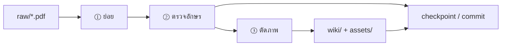

# ย่อยความรู้

Pipeline หลักสำหรับนำ PDF / แหล่งใหม่เข้า vault — จาก `raw/` สู่ `wiki/` + `assets/`

> คำสั่งใน Cursor: ดู CLAUDE.md · โหนดนี้ = แผนที่และ checklist ของขั้นตอน

## Pipeline



| ลำดับ | ขั้น | คำสั่ง Cursor | Output หลัก |
|------|------|---------------|-------------|
| ① | **ย่อย** | `ย่อยเนื้อหา [PDF หรือ topic]` | `wiki/source-*.md` · อัพเดต concept nodes · [[index]] · [[hotcache]] |
| ② | **ตรวจอักษร** | (รัน script หรือขอ agent ตรวจ) | รายงาน typo / อักษรปน · แก้ก่อน commit |
| ③ | **ตัดภาพ** | `ตัดต่อภาพ [PDF]` | `assets/{folder}/` · `assets/catalog-*.md` |

**หมายเหตุลำดับ:** สำหรับ PDF ที่เป็น **สไลด์รูป** มักตัดภาพควบคู่กับย่อย (อ่านจากรูปใน `assets/`) — ถ้า PDF เป็น **ข้อความล้วน** ขั้น ③ อาจข้ามหรือทำทีหลังเมื่อต้องการรูปประกอบ

---

## ① ย่อย

**Input:** PDF ใน `raw/` หรือ topic ที่ระบุ

**Output:**
- `wiki/source-{name}.md` — สรุปตามบท/section พร้อม YAML frontmatter
- อัพเดต concept nodes ที่เกี่ยวข้อง (เพิ่ม section / wikilink)
- concept ใหม่ → สร้าง node ใหม่
- อัพเดต [[index]] ส่วน Source Summaries
- อัพเดต [[hotcache]]

**Checklist ย่อย:**
- [ ] อ่านครบทุกหน้า / ทุก section สำคัญ
- [ ] ชื่อวิทยาศาสตร์ *Genus species* (italic) + วงศ์
- [ ] wikilink `[[node]]` ไม่ใช่ markdown link
- [ ] รูปอ้างอิงใช้ `![[assets/folder/pXXX-YY.ext]]`
- [ ] ระบุแหล่งใน [[reference-sources]] ถ้าเป็น external 🌐

**ตัวอย่างที่ผ่าน pipeline แล้ว:**
- [[source-flower-fruit-seed]] ← `ดอก ผล เมล็ด.pdf`
- [[source-leaf-extended]] ← `สัณฐานวิทยา_ใบ.pdf`

---

## ② ตรวจอักษร

**Input:** ไฟล์ที่แก้ใน session ย่อย (default: `wiki/` + `assets/catalog-*.md`)

**Output:** รายงาน stdout · exit code ≠ 0 ถ้ามีปัญหา

**รัน:**

```bash
python scripts/check-text.py
python scripts/check-text.py wiki/leaf-morphology.md
python scripts/check-text.py --fix   # แก้จากพจนานุกรมที่รู้จัก (ถ้ามี)
```

**ตรวจอะไรบ้าง:**
| ประเภท | ตัวอย่าง | หมายเหตุ |
|--------|---------|----------|
| อักษรปน (Latin ในไทย) | `โcoน` | มักเกิดจาก copy จาก PDF |
| พจนานุกรม typo | `กุหลาด` → `กุหลาบ` | ขยายใน `scripts/check-text.py` |
| รูป path | wikilink ไม่มี prefix `assets/` | Obsidian ไม่แสดงรูป |

**ยังไม่ครอบคลุม (ใช้ workflow `ตรวจสอบ` แยก):** broken wikilink · orphan nodes · coverage ข้อสอบ/ glossary

---

## ③ ตัดภาพ

**Input:** PDF ใน `raw/`

**Output:**
- `assets/{ชื่อ-pdf}/p{page:03d}-{idx:02d}.{ext}`
- `assets/catalog-{name}.md` — ตารางรูป + context ข้อความต่อหน้า

**รัน:**

```bash
python scripts/extract-images.py "raw/ดอก ผล เมล็ด.pdf"
python scripts/extract-images.py "raw/สัณฐานวิทยา_ใบ.pdf" --min-size 50
```

**กฎตัดภาพ:**
1. PyMuPDF (fitz) — ทุกหน้า
2. กรองรูปเล็กกว่า 50px (ปรับได้ด้วย `--min-size`)
3. ตั้งชื่อ `p{page:03d}-{idx:02d}.{ext}`
4. กรอง watermark ซ้ำ (ตรวจ `-01` vs `-02` ด้วยตา)
5. ใน concept node อ้างอิงเฉพาะรูปเนื้อหา · path ต้องมี `assets/`

**ตัวอย่าง catalog:** [[catalog-flower-fruit-seed]] · [[catalog-leaf-morphology]]

---

## หลัง pipeline

| ขั้น | คำสั่ง | เมื่อไหร่ |
|------|--------|----------|
| ตรวจโครงสร้าง vault | `ตรวจสอบ` | ก่อน merge / เป็นระยะ |
| บันทึก git | `checkpoint` | จบ session · หลังแก้ typo แล้ว |
| ทำข้อสอบ / glossary | `ทำข้อสอบ` · `ทำคลังคำศัพท์` | เมื่อ concept พร้อม |

---

## ไฟล์ที่เกี่ยวข้อง

| Path | บทบาท |
|------|--------|
| `raw/` | PDF ต้นฉบับ |
| `wiki/source-*.md` | สรุปแหล่ง |
| `wiki/*.md` | concept nodes |
| `assets/` | รูป + catalog |
| `scripts/check-text.py` | ตรวจอักษร |
| `scripts/extract-images.py` | ตัดภาพจาก PDF |
| `CLAUDE.md` | workflow สำหรับ Cursor agent |

## ดูเพิ่ม

- [[overview]] — Capture → Organize → Distill → Express
- [[reference-sources]] — certified ✅ vs external 🌐
- [[hotcache]] — สถานะ session ล่าสุด
