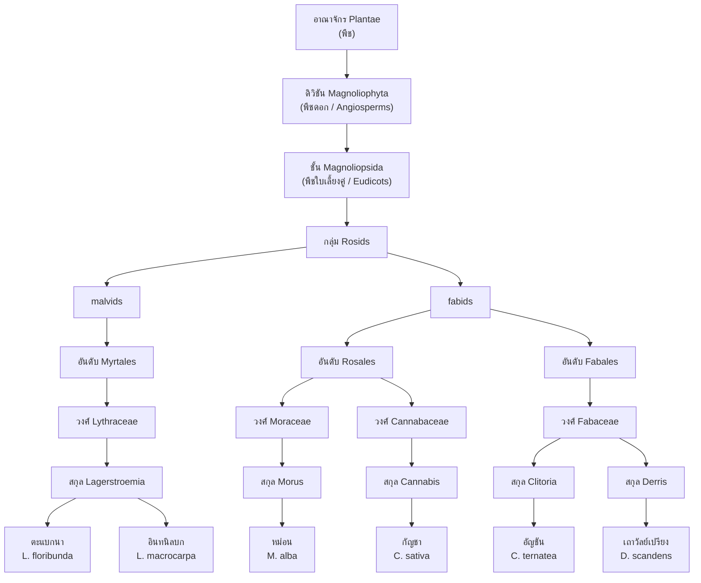

# ผังจำแนกพืชศึกษา 6 ชนิดตามอนุกรมวิธาน 🌐

> **ต่างจาก [[plant-key-6species]] อย่างไร**
> · **รูปวิธาน (key)** = เครื่องมือ *ระบุชนิด* — แตกตามลักษณะที่มองเห็น ทีละ 2 ทาง
> · **ผังอนุกรมวิธาน (classification chart)** = แสดง *ความสัมพันธ์เชิงเครือญาติ* — แตกตามอันดับอนุกรม (rank) จากอาณาจักรลงมาถึงชนิด
> พืชที่อยู่ใกล้กันในรูปวิธาน อาจอยู่คนละวงศ์ก็ได้ · แต่พืชที่อยู่ใกล้กันในผังนี้คือญาติกันจริง

## 1. ผังการจำแนก (Taxonomic tree)

![[assets/charts/chart-taxonomy-6species.png]]

> ภาพนี้สร้างจาก `scripts/make-plant-charts.py` (SVG ต้นฉบับ: `assets/charts/chart-taxonomy-6species.svg`)

### เวอร์ชัน mermaid (แก้ในไฟล์ได้โดยตรง)

## 2. ตารางอันดับอนุกรม (Rank table)

| อันดับอนุกรม | ตะแบกนา | อินทนิลบก | หม่อน | กัญชา | อัญชัน | เถาวัลย์เปรียง |
|---------------|----------|-----------|-------|-------|--------|----------------|
| **อาณาจักร (Kingdom)** | Plantae | Plantae | Plantae | Plantae | Plantae | Plantae |
| **ดิวิชัน (Division)** | Magnoliophyta | ← | ← | ← | ← | ← |
| **ชั้น (Class)** | Magnoliopsida (ใบเลี้ยงคู่) | ← | ← | ← | ← | ← |
| **กลุ่ม (APG)** | malvids | malvids | fabids | fabids | fabids | fabids |
| **อันดับ (Order)** | Myrtales | Myrtales | Rosales | Rosales | Fabales | Fabales |
| **วงศ์ (Family)** | Lythraceae | Lythraceae | Moraceae | Cannabaceae | Fabaceae | Fabaceae |
| **สกุล (Genus)** | *Lagerstroemia* | *Lagerstroemia* | *Morus* | *Cannabis* | *Clitoria* | *Derris* |
| **ชนิด (Species)** | *L. floribunda* Jack | *L. macrocarpa* Wall. ex Kurz | *M. alba* L. | *C. sativa* L. | *C. ternatea* L. | *D. scandens* (Roxb.) Benth. |

## 3. อ่านผังนี้อย่างไร

| ระดับที่แยก | พืชที่แยกออกจากกัน | ลักษณะที่สอดคล้อง |
|--------------|---------------------|---------------------|
| **อันดับ Myrtales** | ตะแบกนา · อินทนิลบก | ไม้ต้น · ใบเดี่ยวเรียงตรงข้าม · ดอกกลีบ 6 ขอบย่น เกสรจำนวนมากบนฐานรองดอกรูปถ้วย · ผลแคปซูลแตก 6 พู เมล็ดมีปีก |
| **อันดับ Rosales** | หม่อน · กัญชา | ดอกลดรูป ไม่มีกลีบดอก **ผสมโดยลม** · ดอกแยกเพศ · มีหูใบ — ความคล้ายนี้อธิบายได้ด้วยเครือญาติ ไม่ใช่ความบังเอิญ |
| **อันดับ Fabales** | อัญชัน · เถาวัลย์เปรียง | **ดอกรูปดอกถั่ว** เกสรเพศผู้ 10 อันแบบ 9+1 · ใบประกอบขนนกปลายคี่ · **ผลเป็นฝัก** · รากมีปมตรึงไนโตรเจน |
| **วงศ์ Fabaceae → สกุล** | *Clitoria* vs *Derris* | วงศ์เดียวกันแต่ต่างสกุล — แยกด้วยลักษณะเถา (ล้มลุก vs เนื้อไม้) และช่อดอก (ดอกเดี่ยวใหญ่ vs ช่อกระจะยาว) |
| **สกุล Lagerstroemia → ชนิด** | *L. floribunda* vs *L. macrocarpa* | สกุลเดียวกัน แยกด้วยเปลือกต้นและขนาดใบ/ดอก/ผล |

## 4. ข้อสังเกตที่ควรเขียนกำกับผัง

1. **หม่อนกับกัญชาเป็นญาติกัน** (อันดับ Rosales) — จึงมีดอกลดรูป ไม่มีกลีบดอก และผสมโดยลมเหมือนกัน แม้หน้าตาต้นจะต่างกันมาก
2. **อัญชันกับเถาวัลย์เปรียงเป็นไม้เถาเหมือนกัน แต่ที่จัดอยู่วงศ์เดียวกันไม่ใช่เพราะเลื้อย** — เป็นเพราะ **ดอกรูปดอกถั่วและผลเป็นฝัก** (ลักษณะการเลื้อยเกิดซ้ำได้ในหลายวงศ์)
3. **ตะแบกกับอินทนิลบกอยู่สกุลเดียวกัน** — เป็นคู่ที่ใกล้ชิดที่สุดในชุดนี้ จึงต้องใช้ลักษณะละเอียด (เปลือก ขนาดผล) แยก
4. **ชื่อชนิดต้องเขียนตัวเอน** และผู้ตั้งชื่อ (author) ไม่ต้องเอน เช่น *Morus alba* L. → ดู [[plant-taxonomy]] §2
5. ระดับ "กลุ่ม (APG)" เป็นการจัดกลุ่มตามข้อมูลพันธุกรรมสมัยใหม่ — ตำราเก่าบางเล่มใช้ **ชั้นย่อย Rosidae** แทน

## Leads to

- [[plant-key-6species]] — รูปวิธานสำหรับ *ระบุชนิด*
- [[plant-morphology-comparison]] — ตารางลักษณะเต็ม 6 ชนิด
- [[plant-taxonomy]] — อันดับอนุกรม · binomial · การตรวจเอกลักษณ์
- Monograph: [[plant-tabaek]] · [[plant-inthanin-bok]] · [[plant-mon]] · [[plant-cannabis]] · [[plant-anchan]] · [[plant-thaowan-priang]]

## ที่มา

ตำแหน่งวงศ์/อันดับอ้างอิงระบบ APG (Angiosperm Phylogeny Group) ผ่านฐานข้อมูล [World Flora Online](https://www.worldfloraonline.org/) และชื่อไทยตาม [ชื่อพรรณไม้แห่งประเทศไทย กรมอุทยานแห่งชาติฯ](https://botany.dnp.go.th/) · ลักษณะพืชอ้างอิงตามแหล่งใน [[reference-sources]] (external source log 2026-08-20)
