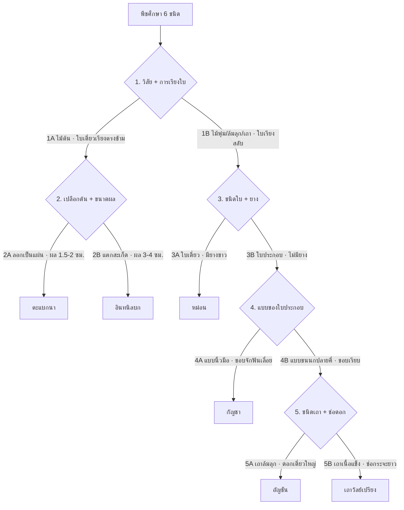

# รูปวิธานพืชศึกษา 6 ชนิด (Dichotomous key) 🌐

> **รูปวิธานแบบสองทางเลือก (dichotomous key)** — ทุกขั้นแยกเป็น 2 ทาง (A / B) โดยใช้ลักษณะที่ **ตรงข้ามกันชัดเจน ตรวจได้จริง และไม่ทับซ้อน**
> พืชศึกษา: ตะแบกนา · อินทนิลบก · หม่อน · กัญชา · อัญชัน · เถาวัลย์เปรียง
> ข้อมูลลักษณะเต็มดูที่ [[plant-morphology-comparison]] และ monograph รายชนิด

## 1. รูปวิธานแบบคู่ขนาน (Bracketed key)

```
1A. ไม้ต้นเนื้อแข็ง ลำต้นเดี่ยวตั้งตรง สูงเกิน 8 เมตร · ใบเดี่ยว เรียงตรงข้าม
    ขอบใบเรียบ · ผลแห้งแตกเป็น 6 พู เมล็ดมีปีก ................................. ไปข้อ 2
1B. ไม้พุ่ม ไม้ล้มลุก หรือไม้เถา · ใบเรียงสลับ
    ผลไม่ใช่ผลแห้งแตก 6 พู ....................................................... ไปข้อ 3

    2A. เปลือกต้นเรียบเป็นมัน สีเทาอมขาว ลอกออกเป็นแผ่นทิ้งรอยด่างเป็นวง
        ใบยาว 12–20 ซม. · ผลยาว 1.5–2 ซม. ..................... ตะแบกนา
                                                Lagerstroemia floribunda Jack
    2B. เปลือกต้นแตกเป็นร่องตื้น หลุดล่อนเป็นสะเก็ดเล็ก โคนต้นเป็นพูพอน
        ใบยาวได้ถึง 40 ซม. · ผลยาว 3–4 ซม. ..................... อินทนิลบก
                                    Lagerstroemia macrocarpa Wall. ex Kurz

3A. ใบเดี่ยว · ทุกส่วนมียางสีขาวคล้ายน้ำนม · เส้นใบออกจากโคน 3 เส้น
    ช่อดอกแบบหางกระรอก · ผลรวม (sorosis) สุกสีม่วงดำ ................ หม่อน
                                                            Morus alba L.
3B. ใบประกอบ · ไม่มียางสีขาว ............................................. ไปข้อ 4

    4A. ใบประกอบ**แบบนิ้วมือ** ใบย่อย 5–7 ใบ แยกจากกันถึงจุดโคนร่วม
        ขอบใบย่อยจักฟันเลื่อยลึก · ไม้ล้มลุกตั้งตรง ไม่เลื้อยพัน
        ดอกแยกเพศต่างต้น ไม่มีกลีบดอก · ผลแห้งเมล็ดล่อน (achene) ....... กัญชา
                                                        Cannabis sativa L.
    4B. ใบประกอบ**แบบขนนกปลายคี่** ขอบใบย่อยเรียบ · ไม้เถาเลื้อยพัน
        ดอกรูปดอกถั่ว · ผลเป็นฝัก ............................................ ไปข้อ 5

        5A. เถาล้มลุกขนาดเล็ก · ใบย่อย 5–7 ใบ · ดอกเดี่ยวที่ซอกใบ ขนาดใหญ่
            สีน้ำเงิน–ม่วง กลีบใหญ่กลับมาอยู่ด้านล่าง (resupinate)
            ฝักยาว 5–7 ซม. แก่แล้วแตกและบิด ......................... อัญชัน
                                                    Clitoria ternatea L.
        5B. เถาเนื้อแข็ง เปลือกน้ำตาลเข้ม บิดเป็นเกลียว · ใบย่อย 7–9 ใบ
            ช่อดอกกระจะยาว 20–30 ซม. ดอกย่อยเล็ก สีขาวอมชมพู
            ฝักแบน 3–8 ซม. ไม่แตก ............................... เถาวัลย์เปรียง
                                        Derris scandens (Roxb.) Benth.
```

## 2. รูปวิธานแบบเยื้อง (Indented key)

```
ก. ไม้ต้น ใบเดี่ยว เรียงตรงข้าม ผลแห้งแตก 6 พู
   ข. เปลือกเรียบ ลอกเป็นแผ่น ด่างเป็นวง · ผล 1.5–2 ซม. ......... ตะแบกนา
   ข. เปลือกแตกสะเก็ด โคนเป็นพูพอน · ผล 3–4 ซม. .............. อินทนิลบก
ก. ไม้พุ่ม/ล้มลุก/เถา ใบเรียงสลับ
   ข. ใบเดี่ยว มียางขาว ผลรวม .................................... หม่อน
   ข. ใบประกอบ ไม่มียางขาว
      ค. ใบประกอบนิ้วมือ ขอบจักฟันเลื่อย ผล achene ............. กัญชา
      ค. ใบประกอบขนนกปลายคี่ ขอบเรียบ ผลเป็นฝัก
         ง. เถาล้มลุก ดอกเดี่ยวใหญ่ ฝักแตก ...................... อัญชัน
         ง. เถาเนื้อแข็ง ช่อกระจะยาว ฝักแบนไม่แตก .......... เถาวัลย์เปรียง
```

## 3. แผนผังการแยก (Key tree)

![[assets/charts/chart-key-6species.png]]

> ภาพนี้สร้างจาก `scripts/make-plant-charts.py` (SVG ต้นฉบับ: `assets/charts/chart-key-6species.svg`) · แก้ข้อความในสคริปต์แล้วสั่งสร้างใหม่ได้

### เวอร์ชัน mermaid (แก้ในไฟล์ได้โดยตรง)



## 4. ลักษณะที่ใช้ตัดสินแต่ละคู่ (Diagnostic character)

| ข้อ | ลักษณะที่ใช้แยก | เหตุผลที่เลือกลักษณะนี้ |
|-----|------------------|--------------------------|
| **1** | วิสัย + การเรียงใบ | แยกได้ทันทีจากระยะไกล และการเรียงใบตรงข้าม/สลับเป็นลักษณะคงที่ระดับวงศ์ |
| **2** | เปลือกต้น + ขนาดผล | ทั้งสองชนิดอยู่สกุลเดียวกัน ดอกคล้ายกันมาก แต่ **เปลือกดูได้ตลอดปี** และผลแห้งค้างต้นได้นาน |
| **3** | ใบเดี่ยว/ใบประกอบ + ยางสีขาว | ยางขาวเป็นลักษณะวงศ์ Moraceae ตรวจได้ใน 3 วินาที (เด็ดก้านใบ) |
| **4** | แบบของใบประกอบ (นิ้วมือ vs ขนนก) + ขอบใบ | แยกวงศ์ Cannabaceae ออกจากวงศ์ถั่วได้เด็ดขาด |
| **5** | ชนิดเถา + ชนิดช่อดอก + ฝัก | ทั้งคู่เป็นวงศ์ถั่ว ดอกรูปดอกถั่วเหมือนกัน จึงต้องใช้ขนาดดอกและลักษณะเถา |

## 5. เทียบกับร่างรูปวิธานที่เขียนไว้ — จุดที่ควรแก้

| ร่างเดิม | ปัญหา | ข้อเสนอ |
|-----------|--------|----------|
| `1B. ไม้พุ่ม ล้มลุก เลื้อย` | ใช้ได้ แต่รวม 3 วิสัยไว้ทางเดียว ทำให้ต้องแยกซ้ำในข้อถัด ๆ ไป | เพิ่มลักษณะใบ (เรียงสลับ) เข้าไปในคู่เดียวกัน เพื่อให้ลักษณะ "ตรงข้ามกัน" ครบคู่ |
| `2A เปลือกบาง / 2B เปลือกหนา` | คำว่า บาง/หนา **วัดยากและเป็นอัตวิสัย** | ใช้ **รูปแบบการหลุดของเปลือก**: ลอกเป็นแผ่นทิ้งรอยด่างเป็นวง (ตะแบก) vs แตกร่องตื้นหลุดเป็นสะเก็ด (อินทนิลบก) — เสริมด้วยขนาดผล 1.5–2 ซม. vs 3–4 ซม. |
| `3A ไม้พุ่ม → หม่อน กัญชา` | **กัญชาเป็นไม้ล้มลุกปีเดียว ไม่ใช่ไม้พุ่ม** ทำให้คู่ขัดแย้งกับ 1B | แยกด้วย **ชนิดใบ**: หม่อน = ใบเดี่ยวมียางขาว · กัญชา = ใบประกอบแบบนิ้วมือ |
| `3B ไม้เลื้อย → อัญชัน เถาวัลย์เปรียง` | ถูกต้อง แต่ยังขาดข้อ 4/5 ที่แยกให้ถึงชนิด | เพิ่มคู่สุดท้าย: เถาล้มลุก + ดอกเดี่ยวใหญ่ (อัญชัน) vs เถาเนื้อแข็ง + ช่อกระจะยาว (เถาวัลย์เปรียง) |

## 6. หลักการเขียนรูปวิธานที่ดี → [[plant-taxonomy]]

1. **แต่ละข้อมี 2 ทางเลือกเท่านั้น** และขึ้นต้นด้วยลักษณะเดียวกัน (เช่น ถ้า A พูดถึงเปลือก B ต้องพูดถึงเปลือกด้วย)
2. **ใช้ลักษณะที่ตรวจได้จริงในภาคสนาม** — เปลือก ใบ ผลแห้ง ดีกว่าดอก เพราะดอกมีเฉพาะบางฤดู
3. **เลี่ยงคำเชิงเปรียบเทียบลอย ๆ** เช่น ใหญ่/เล็ก บาง/หนา — ให้ใส่ตัวเลขกำกับ
4. **ใช้ลักษณะเชิงคุณภาพก่อนเชิงปริมาณ** (มี/ไม่มียางขาว ก่อน ขนาดใบ)
5. **ตรวจย้อนกลับ**: เดินคีย์จากชนิดที่รู้แล้วขึ้นไป ต้องได้เส้นทางเดียวเสมอ

## Leads to

- [[plant-morphology-comparison]] — ตารางลักษณะเต็ม 6 ชนิด
- [[plant-taxonomy]] — อันดับอนุกรม · binomial · การระบุชนิด
- Monograph: [[plant-tabaek]] · [[plant-inthanin-bok]] · [[plant-mon]] · [[plant-cannabis]] · [[plant-anchan]] · [[plant-thaowan-priang]]

## ที่มา

ลักษณะทั้งหมดอ้างอิงตามแหล่งที่บันทึกไว้ในแต่ละ monograph และ [[reference-sources]] (external source log 2026-08-20) · แนวการเขียนรูปวิธานตาม [รูปวิธานระบุพืช มหาวิทยาลัยมหิดล](https://il.mahidol.ac.th/e-media/plants/webcontent3/main.html)
